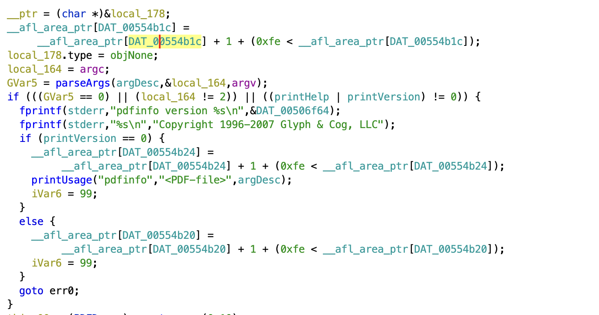
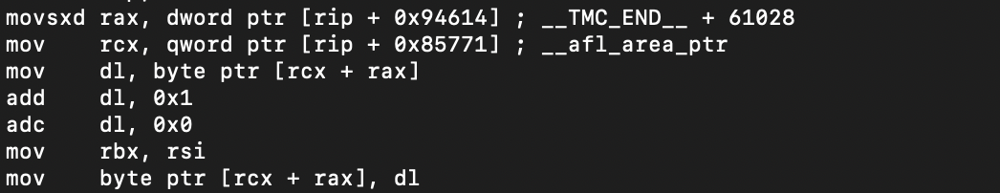
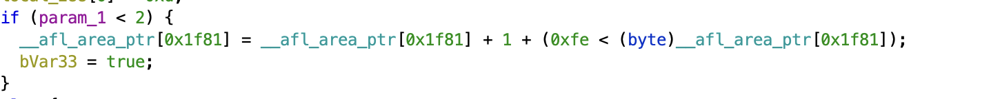
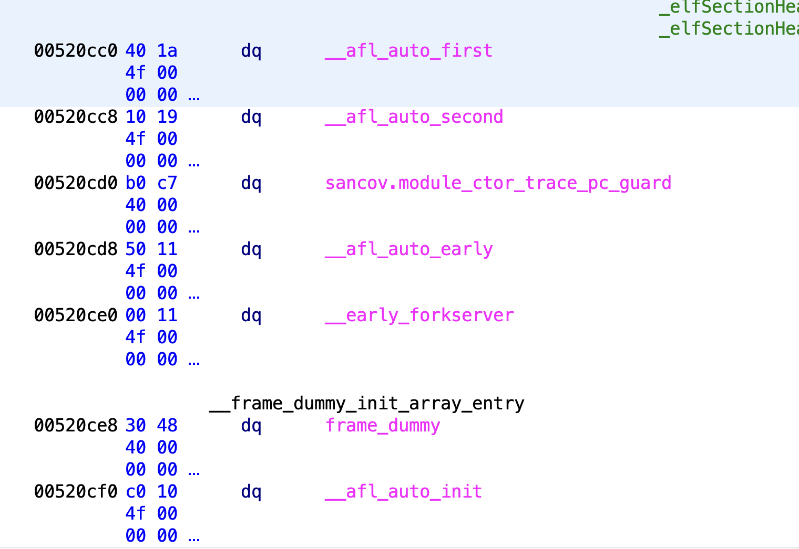
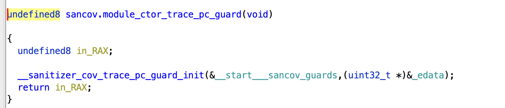
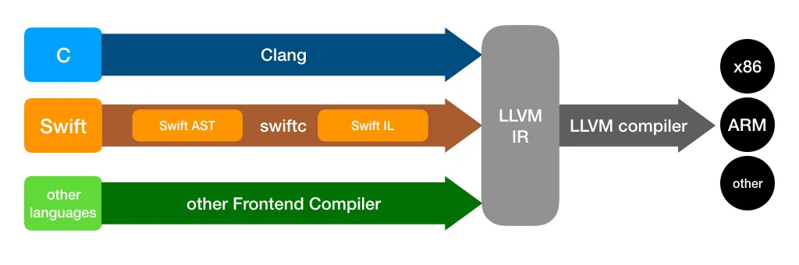
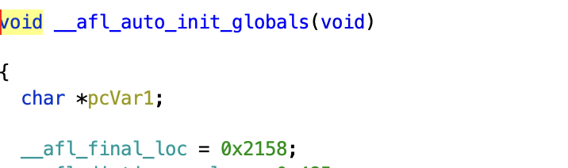

<section>
## How this post is structured

The objective of this post is to allow anyone to gain an understanding of AFL at the level they want. I want to cover AFL at both a usage level and an internals level. 

At the end of this article, there are In-Depth sections that cover AFL in even more depth. 

One additional note. In the code snippets, I often use `...` to replace certain code. This is to increase readability by eliminating the edge case code. I have linked the source code on all code snippets if you are interested in reading that code. 

This is not a user's guide to AFL. For that, I highly recommend checking out [Fuzzing101](https://github.com/antonio-morales/Fuzzing101) by GitHub Security Lab. This post is more targeted at those interested in hacking on AFL or learning a little bit more about the world's favorite fuzzer. 

**Disclaimer: I not a developer on the AFL++ project. This is just my analysis of the source code.**
</section>

<section>
## What is AFL++ and Coverage-Based Fuzzing?
AFL, or the current variation AFL++, is a state-of-the-art fuzzer used to fuzz a wide variety of binaries. Almost every fuzzing campaign today is done using AFL or some variation of AFL. 

AFL is not a random-input fuzzer. AFL does something called coverage-based fuzzing. The idea behind coverage-based fuzzing is to keep track of what areas of the binary are executing or coverage. By keeping track of this information, we are able to figure out which inputs lead to which parts of the code executing. With this, we can develop a database of inputs that cover not only a small subset of the codebase but the entire codebase. This would allow us to find errors everywhere in the code, not only in the most commonly used codepaths. 

However, how do we build that database of inputs - or **corpus**? The answer is iteration. Typically, we start with a few manually generated seed inputs. These seed inputs are then **mutated** (Randomly changed) to see if they cause a change in coverage. If they cause a change in coverage (Among other potential factors), they are deemed interesting and stored in our corpus for further mutation. Eventually, after iteratively mutating on our growing corpus, we will have a corpus that covers the entire codebase. 

Hopefully, we will be able to mutate an input in such a way that we will generate an error in the codepath targeted by that input. 

Let's see an example of coverage given some example code:
```c
int main(){
	input = get_input(); //stub that represents getting the input. Could be via a file, via stdin, or some other means. 
	if(condition A){
		...code A...
	}else if(condition B){
		...code B ..
	}else{
		...code C...
	}
	return 0;
}
```

Suppose we enter our seed input into the program. This input - `seed` - leads to `code C` being executed.

Suppose we then mutate `seed` in some way to generate `seed_A`. This `seed_A`, upon being inputted, leads to `code A` being executed. This is new. With the knowledge that `seed_A` leads to `code A` being executed, we can store `seed_A` in our corpus and mutate it further to allow for new, different code to execute. 

This iterative process of finding new, "interesting" input and building on it is what makes coverage-based fuzzing so powerful. 
</section>

<section>
## AFL++ Architecture
AFL++ starts when the `afl-fuzz` binary is run. The command will usually look something like this:

`afl-fuzz -i [input] -o [output] -- /path/to/fuzzed/binary [@@]`

Typically, the `@@` is replaced with an input file that the process reads from. If no input file is provided, then AFL assumes that the process takes in input using stdin (Or shmem).  

`-i` is the directory containing the seed inputs. 

`-o` is the directory that the output will be placed.

When `afl-fuzz` is run, a series of initialization functions are run. After that, `afl-fuzz` is forked and then exec'd with the target binary. However, the fuzzing itself does not happen in the child process of `afl-fuzz`. Instead, the child process is stopped right before `main` and serves as a "forkserver". This forkserver then forks *again*, and the fuzzing happens in the grandchild process. The reason for this is that forking is much faster than exec. So, it is significantly faster to perform fuzzing in the grandchild than in the child. We will discuss this process further. 

In order for `afl-fuzz` to communicate with the target binary, two pipes are created: a control pipe and a status pipe ([Source]( https://github.com/AFLplusplus/AFLplusplus/blob/ea14f3fd40e32234989043a525e3853fcb33c1b6/src/afl-forkserver.c#L667)). The control pipe is located at `FORKSRV_FD` (Usually `198`) and is read-only for the target binary and write-only for `afl-fuzz`. The status pipe is located at `FORKSRV_FD+1` and is write-only by the target binary and read-only by `afl-fuzz`.

The control pipe is used to send control messages to the target binary. The status pipe is used to send status messages to `afl-fuzz`. 

Now that we have a high-level understanding of what `afl-fuzz` does let's take a closer look at what the binary looks like and is doing. 
</section>

<section>
## Coverage Instrumentation 

In order for AFL++ to work properly (At least in its normal operating mode), the binary must be compiled using a special AFL compiler. This is so that AFL can insert special instructions to keep track of coverage. These special instructions are known as instrumentation. Typically, instrumentaton instructions access what is known as a coverage map. This coverage map is a record of what parts of the code have been accessed.

AFL currently supports many forms of coverage, but the 2 most common and well-supported are PCGUARD and LTO. 

Let's start with PCGUARD. To use PCGUARD instrumentation, you must use the `afl-clang-fast`. To understand PCGUARD, let's take a look at a binary compiled with PCGUARD in Ghidra/lldb:

Decompiled C:


Assembly:


In AFL, the coverage map is `__afl_area_ptr`. `__afl_area_ptr` is an array that is accessed every time a new area is reached. This can be seen in the decompiled C. Notice how there is an access to `__afl_area_ptr` at the top of the function, in the if statement, and in the else statement.

In PCGUARD, The index of `__afl_area_ptr` accessed is determined at runtime. Specifically, the value of the `DAT_*` variable is populated at runtime. This can be seen in the assembly with the `movsxd` where the index is being loaded into `rax`. We will see this process in more detail when we discuss initialization. 

As an aside, notice the `adc dl, 0` in the assembly. This is to ensure that if `add dl, 1` wraps around, `dl != 0`.  If `add dl, 1` wraps around then `CF=1`. So, `adc dl, 0` will result in `dl=1`.

Now let's discuss LTO. LTO coverage can be achieved using the `afl-clang-lto` compiler. LTO coverage is very similar to PCGUARD except the index into `__afl_area_ptr` is populated at compile-time instead of runtime. 

This can be seen in the decompiled C of an LTO binary:



Notice how the index into `__afl_area_ptr` is an immediate instead of a variable. 

For more information on coverage, how it is inserted, and general implementation details I recommend checking out the In-Depth: Coverage Instrumentation and LLVM Hell section which covers the internals of the AFL compiler. 

</section>

<section>
## Initialization and Forkserver

Before we discuss the initialization process, we need to a discuss a feature within ELFs known as the init array. 

When a binary is run, `main` doesn't launch. Instead, we always start with the interpreter (Usually, `ld.so`). The interpreter sets up many key structures for processes like dynamic linking. However, a lesser known feature of the interpreter is its ability to run initialization functions. These initialization functions are located in a section called `.init_array`. This section contains an array of functions that are run in-order right before `main` ([Source 1](https://www.gnu.org/software/hurd/glibc/startup.html), [Source 2](https://github.com/bminor/glibc/blob/9e2ff880f3cbc0b4ec8505ad2ce4a1c92d7f6d56/elf/dl-init.c#L70)). 

The functions in `.init_array` are dependent on whether the binary was compiled with PCGUARD or LTO (However, they are *mostly* the same). 

As we discuss the functions in `.init_array`, there will be many variables, environment variables, macros. For ease of use, I have placed all their definitions below:

Regular Variables:
- `__afl_area_ptr` - The coverage map pointer. By default this is `__afl_area_initial`. The size of `__afl_area_initial` is `MAP_INITIAL_SIZE` ([Source](https://github.com/AFLplusplus/AFLplusplus/blob/ea14f3fd40e32234989043a525e3853fcb33c1b6/instrumentation/afl-compiler-rt.o.c#L91))
- `__afl_final_loc` - The last index in `__afl_area_ptr` accessed by instrumentation
- `__afl_map_addr` - This is the address that the coverage map will be mmap'd. As far as I know, this only really exists when `AFL_LLVM_MAP_ADDR` is set in LTO mode. Otherwise, it is 0. 
- `__afl_map_size ` - The size of the coverage map
- `__afl_area_initial` - The coverage map used before shared memory is mapped and if shared memory is not accessible (i.e. we are not running under AFL). This is created as an array in `afl-compiler-rt.o.c`

Environment Variables:
- `__AFL_SHM_ID` (Aliased to `SHM_ENV_VAR`) - Shared memory ID for the coverage map. 
- `__AFL_SHM_FUZZ_ID` (Aliased to `SHM_FUZZ_ENV_VAR`) - Shared memory ID for shared memory fuzzing.
- `AFL_MAP_SIZE` - Used to set the size of the shared memory buffer allocated by `afl-fuzz`. 

Macros:
- `MAP_SIZE` - a custom value that `afl-fuzz` can use to force the size of the shared memory map. 
- `MAP_INITIAL_SIZE` - size of `__afl_area_initial`
Let's start with PCGUARD. The init functions are as follows:


Let's walk through each function. All of these functions (Except for `sancov.module_ctor_trace_pc_guard`) can be found in [afl-compiler-rt.o.c](https://github.com/AFLplusplus/AFLplusplus/blob/2ff0ff7a903c57f9df5ed1e97370c187ec45a31e/instrumentation/afl-compiler-rt.o.c).

Let's start with [`__afl_auto_first`](https://github.com/AFLplusplus/AFLplusplus/blob/2ff0ff7a903c57f9df5ed1e97370c187ec45a31e/instrumentation/afl-compiler-rt.o.c#L1434). This function does nothing. All it does is set `__afl_already_initialized_first = 1`.

The next function is [`__afl_auto_second`](https://github.com/AFLplusplus/AFLplusplus/blob/2ff0ff7a903c57f9df5ed1e97370c187ec45a31e/instrumentation/afl-compiler-rt.o.c#L1390).  In the case of PCGUARD, this function does nothing. This is because `__afl_final_loc = 0` at this point. We will see that this is actually initialized in the next function. 

The next function is `sancov.module_ctor_trace_pc_guard`. This is actually just a call to [`__sanitizer_cov_trace_pc_guard_init`](https://github.com/AFLplusplus/AFLplusplus/blob/2ff0ff7a903c57f9df5ed1e97370c187ec45a31e/instrumentation/afl-compiler-rt.o.c#L1514) as seen below. For more information on how this call is constructed, I recommend checking out the "In-Depth: Coverage Instrumentation and LLVM Hell" section. 



`__sanitizer_cov_trace_pc_guard_init` is what initializes `__afl_final_loc` and the `DAT_*` variables we saw in the instrumentation. Let's take a look at the function in more detail:

```c
void __sanitizer_cov_trace_pc_guard_init(uint32_t *start, uint32_t *stop) {

  u32   inst_ratio = 100;
  char *x;

  _is_sancov = 1;

...

  if (start == stop || *start) return;

	...

  if (__afl_final_loc < 3) __afl_final_loc = 3;  // we skip the first 4 entries

  *(start++) = ++__afl_final_loc; //start at 4

  while (start < stop) {

    if (likely(inst_ratio == 100) || R(100) < inst_ratio)
      *start = ++__afl_final_loc;
    else
      *start = 0;  // write to map[0]

    start++;

  }
...

}
```
[Source](https://github.com/AFLplusplus/AFLplusplus/blob/2ff0ff7a903c57f9df5ed1e97370c187ec45a31e/instrumentation/afl-compiler-rt.o.c#L1514)

So, this function takes in 2 parameters: `start` and `end`. This represents the `start` and `end` of our guard section, or the section where all of our `DAT_*` variables lie. What we do is go through the entire guard section and populate all the `DAT_*` variables with indices, all while incrementing `__afl_final_loc`. The result of this is that `__afl_final_loc` will equal the final index accessed by coverage.

With this, all of our `DAT_*` variables are populated, and our instrumentation is ready.

The next function is [`__afl_auto_early`](https://github.com/AFLplusplus/AFLplusplus/blob/2ff0ff7a903c57f9df5ed1e97370c187ec45a31e/instrumentation/afl-compiler-rt.o.c#L1375). This function is actually what makes the coverage accessible to `afl-fuzz`. In order to understand `__afl_auto_early`, we need to first discuss shared memory. Shared memory is a feature on Linux used to create memory that can be accessed by multiple processes. Each shared memory instance has its own ID that uniquely identifies it. For 2 processes to access the same shared memory, they both need only map shared memory with the same ID. For more information on shared memory, I recommend reading the [manpage](https://man7.org/linux/man-pages/man7/shm_overview.7.html).

Essentially, `afl-fuzz` creates a shared memory instance and the target process maps that shared memory descriptor as its coverage map. As a result, `afl-fuzz` can see any changes that the child process makes to the coverage map. 

So, `__afl_auto_early` calls [`__afl_map_shm`](https://github.com/AFLplusplus/AFLplusplus/blob/2ff0ff7a903c57f9df5ed1e97370c187ec45a31e/instrumentation/afl-compiler-rt.o.c#L282) which actually does all the work. This function deals with a lot of edge cases, but we are only going to discuss the case where we are running under `afl-fuzz`.  Because of how long, `__afl_map_shm` gets, I decided to comment the relevant code instead of explaining. 

```c
static void __afl_map_shm(void) {

  if (__afl_already_initialized_shm) return;
  __afl_already_initialized_shm = 1;

  // if we are not running in afl ensure the map exists
  if (!__afl_area_ptr) { __afl_area_ptr = __afl_area_ptr_dummy; }

  char *id_str = getenv(SHM_ENV_VAR); //get the shared memory ID. 

  if (__afl_final_loc) { //this should always be true if there are edges.

    __afl_map_size = ++__afl_final_loc;  // increment __afl_final_loc as it is the final index accessed, not the size. 
	...
    if (__afl_final_loc > MAP_SIZE) { //if we have more edges than the shared memory map can accomodate, then we might have a problem. 
      char *ptr;
      u32   val = 0;
      if ((ptr = getenv("AFL_MAP_SIZE")) != NULL) { val = atoi(ptr); } 
      if (val < __afl_final_loc) { //if AFL_MAP_SIZE < __afl_final_loc then the map might not be big enough 
        if (__afl_final_loc > FS_OPT_MAX_MAPSIZE) { //the required map size is too big. We need to leave if we are running under AFL. If we are not running under AFL, we can simply allocate the necessary memory. For more information on this visit In-Depth: afl-fuzz initialzation. 
          if (!getenv("AFL_QUIET"))
            fprintf(stderr,
                    "Error: AFL++ tools *require* to set AFL_MAP_SIZE to %u "
                    "to be able to run this instrumented program!\n",
                    __afl_final_loc);
          if (id_str) {
            send_forkserver_error(FS_ERROR_MAP_SIZE);
            exit(-1);
          }
        } else { //if AFL_MAP_SIZE > MAP_INITIAL_SIZE, then the allocated map size *might* be too small. For more information on this, visit In-Depth: afl-fuzz initialzation.
          if (__afl_final_loc > MAP_INITIAL_SIZE && !getenv("AFL_QUIET")) {
            fprintf(stderr,
                    "Warning: AFL++ tools might need to set AFL_MAP_SIZE to %u "
                    "to be able to run this instrumented program if this "
                    "crashes!\n",
                    __afl_final_loc);
          }
        }
      }
    }
  } else {
	...
    }

  }
...
    u32 shm_id = atoi(id_str); //get the shm_id. This will be used to access the 
    if (__afl_map_size && __afl_map_size > MAP_SIZE) {
             u8 *map_env = (u8 *)getenv("AFL_MAP_SIZE");
             if (!map_env || atoi((char *)map_env) < MAP_SIZE) {
               send_forkserver_error(FS_ERROR_MAP_SIZE);
               _exit(1);
      }
    }
    __afl_area_ptr = (u8 *)shmat(shm_id, (void *)__afl_map_addr, 0); //map in the shared memory and set it equal to __afl_area_ptr. From here, instead of accessing some dummy memory, the instrumentation will be accessing the shared memory, and, as such, the changes will be visible to the afl-fuzz. 

    /* Whooooops. */
    if (!__afl_area_ptr || __afl_area_ptr == (void *)-1) {
             if (__afl_map_addr)
        send_forkserver_error(FS_ERROR_MAP_ADDR);
      else
        send_forkserver_error(FS_ERROR_SHMAT);
      perror("shmat for map");
             _exit(1);
    }
    /* Write something into the bitmap so that even with low AFL_INST_RATIO,
       our parent doesn't give up on us. */
    __afl_area_ptr[0] = 1;
  } 
  ...
}
```
[Source](https://github.com/AFLplusplus/AFLplusplus/blob/2ff0ff7a903c57f9df5ed1e97370c187ec45a31e/instrumentation/afl-compiler-rt.o.c#L282)

With this, `__afl_area_ptr` is set up and pointing to shared memory. 

Now, we go to [`__early_forkserver`](https://github.com/AFLplusplus/AFLplusplus/blob/24503fba5fd2580559223ec3c6ee408dfa15e080/instrumentation/afl-compiler-rt.o.c#L1367). This function does nothing unless we ask for an early forkserver.

The final function is [ `__afl_auto_init`](https://github.com/AFLplusplus/AFLplusplus/blob/24503fba5fd2580559223ec3c6ee408dfa15e080/instrumentation/afl-compiler-rt.o.c#L1339). In this function, we actually communicate with `afl-fuzz` and we begin to run our testcases. In `__afl_auto_init`, we call [`__afl_manual_init`](https://github.com/AFLplusplus/AFLplusplus/blob/24503fba5fd2580559223ec3c6ee408dfa15e080/instrumentation/afl-compiler-rt.o.c#L1307) which in turn calls [`__afl_start_forkserver`](https://github.com/AFLplusplus/AFLplusplus/blob/24503fba5fd2580559223ec3c6ee408dfa15e080/instrumentation/afl-compiler-rt.o.c#L1002).  This is where the meat of the function happens. 

The first important snippet is below:

```c
  if (__afl_map_size <= FS_OPT_MAX_MAPSIZE) {
    status_for_fsrv |= (FS_OPT_SET_MAPSIZE(__afl_map_size) | FS_OPT_MAPSIZE);
  }

  if (__afl_dictionary_len && __afl_dictionary) {
    status_for_fsrv |= FS_OPT_AUTODICT;
  }

  if (__afl_sharedmem_fuzzing) { status_for_fsrv |= FS_OPT_SHDMEM_FUZZ; }
  if (status_for_fsrv) {
    status_for_fsrv |= (FS_OPT_ENABLED | FS_OPT_NEWCMPLOG);
  }

  memcpy(tmp, &status_for_fsrv, 4);

  /* Phone home and tell the parent that we're OK. If parent isn't there,
     assume we're not running in forkserver mode and just execute program. */

  if (write(FORKSRV_FD + 1, tmp, 4) != 4) { return; }

```
[Source](https://github.com/AFLplusplus/AFLplusplus/blob/24503fba5fd2580559223ec3c6ee408dfa15e080/instrumentation/afl-compiler-rt.o.c#L1032)

The idea behind this snippet is essentially to tell `afl-fuzz` about the target binary. We tell them about the map size, if we have a dictionary, and whether we are using shared memory fuzzing. Then we write that result to `FORKSRV_FD+1` which, as we discussed earlier, is the status pipe.

From here, we enter the while loop which actually does the real fuzzing. I have commented it for ease of reading:
```c
  while (1) {

    int status;
    /* Wait for parent by reading from the pipe. Abort if read fails. */
    if (already_read_first) {
      already_read_first = 0;
    } else {
      if (read(FORKSRV_FD, &was_killed, 4) != 4) {
        _exit(1);
      }
    }
...
    /* If we stopped the child in persistent mode, but there was a race
       condition and afl-fuzz already issued SIGKILL, write off the old
       process. */
    if (child_stopped && was_killed) {
      child_stopped = 0;
      if (waitpid(child_pid, &status, 0) < 0) {
        write_error("child_stopped && was_killed");
        _exit(1);
      }

    }
    if (!child_stopped) {
      /* Once woken up, create a clone of our process. */
      child_pid = fork(); //fork the process. launch the grandchild
      if (child_pid < 0) {
        write_error("fork");
        _exit(1);
      }
      /* In child process: close fds, resumecexecution. */
	//remember: fork returns 0 for the child and the child pid for the parent
      if (!child_pid) { 
        //(void)nice(-20);
        signal(SIGCHLD, old_sigchld_handler); //reset signal handlers. 
        signal(SIGTERM, old_sigterm_handler);
        close(FORKSRV_FD); //close the pipes
        close(FORKSRV_FD + 1);
        return; //return to main
      }
    } else {
      /* Special handling for persistent mode: if the child is alive but
         currently stopped, simply restart it with SIGCONT. */
      kill(child_pid, SIGCONT);
      child_stopped = 0;

    }

    /* In parent process: write PID to pipe, then wait for child. */

    if (write(FORKSRV_FD + 1, &child_pid, 4) != 4) { //tell the parent the pid of its grandchild

      write_error("write to afl-fuzz");
      _exit(1);

    }

    if (waitpid(child_pid, &status, is_persistent ? WUNTRACED : 0) < 0) { //wait for the child to finish.

      write_error("waitpid");
      _exit(1);

    }

    /* In persistent mode, the child stops itself with SIGSTOP to indicate
       a successful run. In this case, we want to wake it up without forking
       again. */

    if (WIFSTOPPED(status)) child_stopped = 1; 

    /* Relay wait status to pipe, then loop back. */

    if (write(FORKSRV_FD + 1, &status, 4) != 4) { //tell the parent that we are done. This will give the parent an oppurtunity to check and reset the coverage map, mutate, etc. 

      write_error("writing to afl-fuzz");
      _exit(1);

    }

  }
```
[Source](https://github.com/AFLplusplus/AFLplusplus/blob/24503fba5fd2580559223ec3c6ee408dfa15e080/instrumentation/afl-compiler-rt.o.c#L1120)

The above code is essentially the forkserver. Essentially, in order to perform our fuzzing, we continually fork the child. 

With all of these functions, the fuzzer is set up, and we are successfully fuzzing. However, there are ways that we can make fuzzing much faster. 

</section>

<section>
## Persistent Mode

Persistent mode is a way to make fuzzing faster. In general, when we fuzz, we have to restart the program every time we want to run a test case. However, what if we wanted to test one small subset of the code. This is where persistent mode is useful.

According to the AFL++ documentation, in persistent mode "AFL++ fuzzes a target multiple times in a single forked process, instead of forking a new process for each fuzz execution" ([Source](https://github.com/AFLplusplus/AFLplusplus/blob/24503fba5fd2580559223ec3c6ee408dfa15e080/instrumentation/README.persistent_mode.md)). In order to describe persistent mode, it is easier to look at an example. Consider the following code snippet:

```c
#include "what_you_need_for_your_target.h"

main() {
  // anything else here, e.g. command line arguments, initialization, etc.
  unsigned char buf[1024];
  
  while (__AFL_LOOP(10000)) { //loop
    int len = read(0,buf,1024);  
                                    
    if (len < 8) continue;  // check for a required/useful minimum input 
    target_function(buf, len);
    memset(buf, 0, 1024); //reset the state
    /* Reset state. e.g. libtarget_free(tmp) */
  }
  return 0;
}
```
Code modified from [here](https://github.com/AFLplusplus/AFLplusplus/blob/24503fba5fd2580559223ec3c6ee408dfa15e080/instrumentation/README.persistent_mode.md)

When we are running in persistent mode, the forkserver changes a little bit. Specifically, the `waitpid` condition changes. This can be seen in the if statement below:

```c
if (waitpid(child_pid, &status, is_persistent ? WUNTRACED : 0) < 0) 
```
[Source](https://github.com/AFLplusplus/AFLplusplus/blob/24503fba5fd2580559223ec3c6ee408dfa15e080/instrumentation/afl-compiler-rt.o.c#L1229)

If the binary is persistent, then we wait until the child has stopped (`WUNTRACED`) instead of exited. The reason for this can be found in the `__AFL_LOOP` macro which expands to [`__afl_persistent_loop`](https://github.com/AFLplusplus/AFLplusplus/blob/24503fba5fd2580559223ec3c6ee408dfa15e080/instrumentation/afl-compiler-rt.o.c#L1258). 

The idea behind this function is that there is a static variable `cycle_cnt` which is equivalent to the number of loops remaining. At the end of every loop (Except when `cycle_cnt = 0` at which point we stop), we raise a `SIGSTOP` ([Source](https://github.com/AFLplusplus/AFLplusplus/blob/24503fba5fd2580559223ec3c6ee408dfa15e080/instrumentation/afl-compiler-rt.o.c#L1282)). This triggers the `waitpid` condition above which allows `afl-fuzz` to perform its mutations and reset the coverage map. Once control is returned to the forkserver, the binary is resumed via a `SIGCONT` ([Source](https://github.com/AFLplusplus/AFLplusplus/blob/24503fba5fd2580559223ec3c6ee408dfa15e080/instrumentation/afl-compiler-rt.o.c#L958)). 

This loop structure allows the section of code within the loop to run multiple times without having to restart the binary which can often be very slow. 

</section>
<section>
## Shared Memory Fuzzing

Shared memory fuzzing is a way to make fuzzing even faster. Typically, the target binary will read from stdin or from a file passed in as a command line argument. However, this can be slow as it requires a read system call. So, how do we make this faster?

The answer is shared memory fuzzing. In the same way that the coverage map is shared memory, we also make the input shared memory. This allows `afl-fuzz` to write the input test cases to a shared memory buffer instead of a file. 

To facilitate shared memory fuzzing, we need to modify the source code a bit. Consider the code snippet below:

```c
#include "what_you_need_for_your_target.h"
__AFL_FUZZ_INIT();
main() {
  // anything else here, e.g. command line arguments, initialization, etc.
  unsigned char *buf = __AFL_FUZZ_TESTCASE_BUF;  // must be after __AFL_INIT
                                                 // and before __AFL_LOOP!
  while (__AFL_LOOP(10000)) {
    int len = __AFL_FUZZ_TESTCASE_LEN;  // don't use the macro directly in a
                                        // call!
    if (len < 8) continue;  // check for a required/useful minimum input length
    /* Setup function call, e.g. struct target *tmp = libtarget_init() */
    /* Call function to be fuzzed, e.g.: */
    target_function(buf, len);
    /* Reset state. e.g. libtarget_free(tmp) */
  }
  return 0;
}

```

In the above source code, we have enabled shared memory fuzzing. Our `__AFL_FUZZ_TESTCASE_BUF` is the actual testcase buffer. This buffer points to a shared memory region. This memory region is updated between loops. `__AFL_FUZZ_TESTCASE_LEN` is the actual length of the data within the shared memory region. To understand shared memory fuzzing, it is also helpful to look at the initialization process.

The initialization for shared memory fuzzing begins at a function called [`__afl_map_shm_fuzz`](https://github.com/AFLplusplus/AFLplusplus/blob/ea14f3fd40e32234989043a525e3853fcb33c1b6/instrumentation/afl-compiler-rt.o.c#L214). This function is called from `__afl_start_forkserver` whenever shared memory fuzzing is detected ([Source](https://github.com/AFLplusplus/AFLplusplus/blob/ea14f3fd40e32234989043a525e3853fcb33c1b6/instrumentation/afl-compiler-rt.o.c#L1070)). Shared memory fuzzing is detected via the variable `__afl_sharedmem_fuzzing` which is set to `1` whenever shared memory is used. This variable is set to `1` when the macro `__AFL_FUZZ_INIT()` is used ([Source](https://github.com/AFLplusplus/AFLplusplus/blob/ef706ad668b36e65d24f352f5bcee22957f5f1cc/src/afl-cc.c#L1311)).

`__afl_map_shm_fuzz` works in a very similar manner to `__afl_map_shm`. It get's the shmem ID from the environment variable `__AFL_SHM_FUZZ_ID` - often aliased to `SHM_FUZZ_ENV_VAR` ([Source](https://github.com/AFLplusplus/AFLplusplus/blob/ea14f3fd40e32234989043a525e3853fcb33c1b6/instrumentation/afl-compiler-rt.o.c#L216)). It then runs a `shmat` to map the shared memory region to the process ([Source](https://github.com/AFLplusplus/AFLplusplus/blob/ea14f3fd40e32234989043a525e3853fcb33c1b6/instrumentation/afl-compiler-rt.o.c#L247)). 

After the region is mapped, we then set `__afl_fuzz_len` and `__afl_fuzz_ptr` (Aliased to `__AFL_FUZZ_TESTCASE_LEN` and `__AFL_FUZZ_TESTCASE_BUF` respectively) like so:

```
__afl_fuzz_len = (u32 *)map;
__afl_fuzz_ptr = map + sizeof(u32);
```
[Source](https://github.com/AFLplusplus/AFLplusplus/blob/ea14f3fd40e32234989043a525e3853fcb33c1b6/instrumentation/afl-compiler-rt.o.c#L261)

Notice how `__afl_fuzz_len` is actually a `u32*` as the first 4 bytes of the map are actually the size of the written data.

If you're interested in learning more about how both shared memory fuzzing and persistent mode fuzzing work, I highly suggest compiling and analyzing the demo code found [here](https://github.com/AFLplusplus/AFLplusplus/blob/7101192865893e00b9029d0cb898a3ca3015d50b/utils/persistent_mode/persistent_demo_new.c) in a debugger or a diassembler like Ghidra. 

</section>
<section>
## Sanitizers

Many might ask what about memory errors (i.e. buffer overflow, heap overflow, use-after-free, etc.)? How can coverage instrumentation help detect those. Unfortunately, coverage-based fuzzing cannot detect memory errors. Instead, we must use what is called a sanitizer.

There are many kinds of sanitizers all dedicated to detecting different kinds of errors including invalid memory accesses (i.e. UAF), uninitialized memory use, and undefined behavior. 

Because of how complicated some of them can get, I'm not going to explain them here. For more information, Google has published a fantastic wiki describing each sanitizer and its implementation [here](https://github.com/google/sanitizers/wiki). 


</section>
<section>
## In-Depth: `afl-fuzz` initialization and runtime processes

### Initializing `afl-fuzz`

To understand how AFL++ fuzzes, it is useful to look at the source code of `afl_fuzz` - the main function can be found [here](https://github.com/AFLplusplus/AFLplusplus/blob/ea14f3fd40e32234989043a525e3853fcb33c1b6/src/afl-fuzz.c#L501 "https://github.com/AFLplusplus/AFLplusplus/blob/ea14f3fd40e32234989043a525e3853fcb33c1b6/src/afl-fuzz.c#L501").

There are 2 key structures that we will be paying attention to: [`afl_state_t`](https://github.com/AFLplusplus/AFLplusplus/blob/ea14f3fd40e32234989043a525e3853fcb33c1b6/include/afl-fuzz.h#L427) and [`afl_forkserver_t`](https://github.com/AFLplusplus/AFLplusplus/blob/ea14f3fd40e32234989043a525e3853fcb33c1b6/include/forkserver.h#L80). 

`afl_state_t` is the structure that manages the fuzzer and many of its parameters including mutator parameters, the observers, feedbacks, and more. 

`afl_forkserver_t` manages the forkserver. The forkserver is something that we will discuss later, but, at a high level, it is what executes the binary to be fuzzed. This structure contains other key information including the input file and parameters about what the forkserver is doing (Is it Nyx? Qemu?). `afl_forkserver_t` is embedded in `afl_state_t`. 

In order to initialize `afl-fuzz` we start at [main](https://github.com/AFLplusplus/AFLplusplus/blob/ea14f3fd40e32234989043a525e3853fcb33c1b6/src/afl-fuzz.c#L501) in `afl-fuzz.c`. There's a lot here, and most of it is to deal with edge cases like QEMU-mode, Nyx-mode, Frida-mode, etc.

The first important thing we do is get the `map_size`. This will be the size of the shared memory coverage map. To get the `map_size` we call `get_map_size` ([Source](https://github.com/AFLplusplus/AFLplusplus/blob/ea14f3fd40e32234989043a525e3853fcb33c1b6/src/afl-fuzz.c#L506)) which does the following: 

```c
u32 get_map_size(void) {

  uint32_t map_size = DEFAULT_SHMEM_SIZE;
  char    *ptr;
  if ((ptr = getenv("AFL_MAP_SIZE")) || (ptr = getenv("AFL_MAPSIZE"))) {
    map_size = atoi(ptr);
    if (!map_size || map_size > (1 << 29)) {
      FATAL("illegal AFL_MAP_SIZE %u, must be between %u and %u", map_size, 64U,
            1U << 29);
    }
    if (map_size % 64) { map_size = (((map_size >> 6) + 1) << 6); }
  } else if (getenv("AFL_SKIP_BIN_CHECK")) {
    map_size = MAP_SIZE;
  }
  return map_size;

}
```
[Source](https://github.com/AFLplusplus/AFLplusplus/blob/24503fba5fd2580559223ec3c6ee408dfa15e080/src/afl-common.c#L1302)

By default, we use `DEFAULT_SHMEM_SIZE` which has a size of 8 MB ([Source](https://github.com/AFLplusplus/AFLplusplus/blob/ea14f3fd40e32234989043a525e3853fcb33c1b6/include/config.h#L44)). Otherwise, we can set the map size using the `AFL_MAP_SIZE` or `AFL_MAPSIZE` environment variables.

The second important thing we do is initialize the `afl_state_t` and `afl_forkserver_t`:

```c
  afl_state_init(afl, map_size);
  ...
  afl_fsrv_init(&afl->fsrv);
```
[Source](https://github.com/AFLplusplus/AFLplusplus/blob/ea14f3fd40e32234989043a525e3853fcb33c1b6/src/afl-fuzz.c#L535)

These two functions set a few important variables of note. `afl_state_init` sets the map size to `map_size` as seen below:

```c
afl->shm.map_size = map_size ? map_size : MAP_SIZE;
```
[Source](https://github.com/AFLplusplus/AFLplusplus/blob/24503fba5fd2580559223ec3c6ee408dfa15e080/src/afl-fuzz-state.c#L86)

`afl_fsrv_init` sets the following variables:

```c
fsrv->out_fd = -1; //set out_fd to -1 by default
...
fsrv->use_stdin = true; //by default use stdin
...
fsrv->child_pid = -1; //set the child_pid to -1
```
[Source](https://github.com/AFLplusplus/AFLplusplus/blob/7101192865893e00b9029d0cb898a3ca3015d50b/src/afl-forkserver.c#L91)

After this, we set `afl->shmem_testcase_mode = 1` ([Source](https://github.com/AFLplusplus/AFLplusplus/blob/ea14f3fd40e32234989043a525e3853fcb33c1b6/src/afl-fuzz.c#L551)). This will ensure that we always try to use shared memory testcases if possible.

From here, `afl-fuzz` runs through the command line flags and stores them as necessary. A lot of these command line arguments are intended handle AFL's other operating modes such as QEMU or Frida. However, there is one command line flag we care about: `-o` which represents the output directory:

```c
      case 'o':                                               /* output dir */
        if (afl->out_dir) { FATAL("Multiple -o options not supported"); }
        afl->out_dir = optarg;
```
[Source](https://github.com/AFLplusplus/AFLplusplus/blob/ea14f3fd40e32234989043a525e3853fcb33c1b6/src/afl-fuzz.c#L678)
Below is the main file setup code:

```c
    if ((afl->tmp_dir = afl->afl_env.afl_tmpdir) != NULL && !afl->in_place_resume)
...
  } else {
    afl->tmp_dir = afl->out_dir;
  }

  
  if (!afl->fsrv.out_file) {
    u32 j = optind + 1;
    while (argv[j]) {
      u8 *aa_loc = strstr(argv[j], "@@");
      if (aa_loc && !afl->fsrv.out_file) {
        afl->fsrv.use_stdin = 0;
        default_output = 0;
        if (afl->file_extension) {
          afl->fsrv.out_file = alloc_printf("%s/.cur_input.%s", afl->tmp_dir,
                                            afl->file_extension);
        } else {
          afl->fsrv.out_file = alloc_printf("%s/.cur_input", afl->tmp_dir);
        }
        detect_file_args(argv + optind + 1, afl->fsrv.out_file,
                         &afl->fsrv.use_stdin);
        break;
      }
      ++j;
    }
  }
  if (!afl->fsrv.out_file) { setup_stdio_file(afl); }
```
[Source](https://github.com/AFLplusplus/AFLplusplus/blob/ea14f3fd40e32234989043a525e3853fcb33c1b6/src/afl-fuzz.c#L1935)

Here, `afl->fsrv.out_file` is the file that inputs will be written to. 

In the above code, we do a few things. We firstly go through `argv` and try to find an instance of `@@`. Remember that `@@` will be replaced with the input file if we are passing input as a command line argument. If we find an `@@`, then we do an `alloc_printf` which is functionally an `sprintf`  to construct that path that testcases will be written to. We also set `afl->fsrv.use_stdin` to `0` to indicate that we are using command line arguments. 

The specific path that is used is `[output dir]/.cur_input`. Note that you can force it to use a directory that is not the output directory by using the `AFL_TMPDIR` environemnt variable ([Source](https://aflplus.plus/docs/env_variables/)). As described in the AFL++ documentation, this is especially useful when you point it to a ramdisk mounted filesystem which will increase performance.

In the case that `@@` is not detected, we then run [`setup_stdio_file`](https://github.com/AFLplusplus/AFLplusplus/blob/24503fba5fd2580559223ec3c6ee408dfa15e080/src/afl-fuzz-init.c#L2132):

```c
void setup_stdio_file(afl_state_t *afl) {
  if (afl->file_extension) {
    afl->fsrv.out_file =
        alloc_printf("%s/.cur_input.%s", afl->tmp_dir, afl->file_extension);
  } else {
    afl->fsrv.out_file = alloc_printf("%s/.cur_input", afl->tmp_dir);
  }
  unlink(afl->fsrv.out_file);                              /* Ignore errors */
  afl->fsrv.out_fd =
      open(afl->fsrv.out_file, O_RDWR | O_CREAT | O_EXCL, DEFAULT_PERMISSION);
  if (afl->fsrv.out_fd < 0) {
    PFATAL("Unable to create '%s'", afl->fsrv.out_file);
  }
}
```
[Source](https://github.com/AFLplusplus/AFLplusplus/blob/24503fba5fd2580559223ec3c6ee408dfa15e080/src/afl-fuzz-init.c#L2132)

This is surprisingly similar to the code for command line arguments. However, notice that, as opposed to `@@`, we open the output file. We will see why this is later. 

We're almost ready to launch the fuzzer. Firstly, we have to setup our shared memory descriptors for both the coverage map and the shared memory test cases. 


Shared memory testcase setup:
```c
if (afl->shmem_testcase_mode) { setup_testcase_shmem(afl); }
```
[Source](https://github.com/AFLplusplus/AFLplusplus/blob/ea14f3fd40e32234989043a525e3853fcb33c1b6/src/afl-fuzz.c#L2008)

As we discussed, `afl->shmem_testcase_mode` is always `1`, so, we run [`setup_testcase_shmem`](https://github.com/AFLplusplus/AFLplusplus/blob/24503fba5fd2580559223ec3c6ee408dfa15e080/src/afl-fuzz-init.c#L2583) which does the following:

```c
void setup_testcase_shmem(afl_state_t *afl) {
  afl->shm_fuzz = ck_alloc(sizeof(sharedmem_t));
  // we need to set the non-instrumented mode to not overwrite the SHM_ENV_VAR
  u8 *map = afl_shm_init(afl->shm_fuzz, MAX_FILE + sizeof(u32), 1);
  afl->shm_fuzz->shmemfuzz_mode = 1;
  if (!map) { FATAL("BUG: Zero return from afl_shm_init."); }
#ifdef USEMMAP
  setenv(SHM_FUZZ_ENV_VAR, afl->shm_fuzz->g_shm_file_path, 1);
#else
  u8 *shm_str = alloc_printf("%d", afl->shm_fuzz->shm_id);
  setenv(SHM_FUZZ_ENV_VAR, shm_str, 1);
  ck_free(shm_str);
#endif
  afl->fsrv.support_shmem_fuzz = 1;
  afl->fsrv.shmem_fuzz_len = (u32 *)map;
  afl->fsrv.shmem_fuzz = map + sizeof(u32);
}
```
[Source](https://github.com/AFLplusplus/AFLplusplus/blob/24503fba5fd2580559223ec3c6ee408dfa15e080/src/afl-fuzz-init.c#L2583)

This code does a few important things. Firstly, it creates the actual shared memory region using `afl_shm_init`. Then we set the environment variable `SHM_FUZZ_ENV_VAR`. As we saw, this environment variable is used by instrumentation to setup the share testcase memory region. In addition to setting up environment variables, it also sets the `fsrv` variables. Notice how `afl->fsrv.shmem_fuzz_len = (u32 *)map;`. This is consistent with what we saw earlier we saw that `__afl_fuzz_len = (u32*)map` in the instrumentation setup. 

Next, we setup the shared coverage map: 

```c
  afl->fsrv.trace_bits =
      afl_shm_init(&afl->shm, afl->fsrv.map_size, afl->non_instrumented_mode);
  ...
    if (map_size <= DEFAULT_SHMEM_SIZE) {
      afl->fsrv.map_size = DEFAULT_SHMEM_SIZE;  // dummy temporary value
      char vbuf[16];
      snprintf(vbuf, sizeof(vbuf), "%u", DEFAULT_SHMEM_SIZE);
      setenv("AFL_MAP_SIZE", vbuf, 1);
    }
```
[Source](https://github.com/AFLplusplus/AFLplusplus/blob/ea14f3fd40e32234989043a525e3853fcb33c1b6/src/afl-fuzz.c#L2054)

This is fairly similar to how shared testcase memory is setup as we are once again using `afl_shm_init`, Notice how the size is  `afl->fsrv.map_size`. Notice how we also get the shared memory size

Once all of this is setup, we are finally ready to start the forkserver. This is done via `afl_fsrv_get_mapsize` which does the following:

```c
u32 afl_fsrv_get_mapsize(afl_forkserver_t *fsrv, char **argv,
                         volatile u8 *stop_soon_p, u8 debug_child_output) {
  afl_fsrv_start(fsrv, argv, stop_soon_p, debug_child_output);
  return fsrv->map_size;
}
```
[Source](https://github.com/AFLplusplus/AFLplusplus/blob/7101192865893e00b9029d0cb898a3ca3015d50b/src/afl-forkserver.c#L1210)

We then call [`afl_fsrv_start`]() which does the real work. Most of the beginning of this function is setting up parameters for certain options/operating modes. The real work begins we when we setup the pipes and fork:

```c
if (pipe(st_pipe) || pipe(ctl_pipe)) { PFATAL("pipe() failed"); }
...
fsrv->fsrv_pid = fork();
```
[Source](https://github.com/AFLplusplus/AFLplusplus/blob/7101192865893e00b9029d0cb898a3ca3015d50b/src/afl-forkserver.c#L582)

From here, we can focus on the child and the parent individually. The code for the child can be seen below:

```c
    if (!fsrv->use_stdin) {
      dup2(fsrv->dev_null_fd, 0);
    } else {
      dup2(fsrv->out_fd, 0);
      close(fsrv->out_fd);
    }
    
    if (dup2(ctl_pipe[0], FORKSRV_FD) < 0) { PFATAL("dup2() failed"); }
    if (dup2(st_pipe[1], FORKSRV_FD + 1) < 0) { PFATAL("dup2() failed"); }
    close(ctl_pipe[0]);
    close(ctl_pipe[1]);
    close(st_pipe[0]);
    close(st_pipe[1]);
	...
    /* This should improve performance a bit, since it stops the linker from
       doing extra work post-fork(). */

    if (!getenv("LD_BIND_LAZY")) { setenv("LD_BIND_NOW", "1", 1); }
    /* Set sane defaults for sanitizers */
    set_sanitizer_defaults();
    fsrv->init_child_func(fsrv, argv);

```
[Source](https://github.com/AFLplusplus/AFLplusplus/blob/7101192865893e00b9029d0cb898a3ca3015d50b/src/afl-forkserver.c#L654)

The child does not do much. Firstly, if we are using stdin for out input, we replace stdin with a file descriptor pointing to our `out_fd` we set earlier. 

Then, we `dup2` to set the read side of the control pipe of `FORKSRV_FD` and the write side of the status pipe to `FORKSRV_FD+1`. This will ensure that the child has access to the correct pipes. We then close all the pipes so that we don't have any extraneous file descriptors open. 

We then run `fsrv->init_child_func(fsrv, argv)` to actually launch the child process.

Let's move to the parent. The parent is much more complicated. let's start by reading the code right after the fork:

```c
  close(ctl_pipe[0]);
  close(st_pipe[1]);

  fsrv->fsrv_ctl_fd = ctl_pipe[1];
  fsrv->fsrv_st_fd = st_pipe[0];

  /* Wait for the fork server to come up, but don't wait too long. */
  rlen = 0;
  if (fsrv->init_tmout) {
	...
  } else {
    rlen = read(fsrv->fsrv_st_fd, &status, 4);
  }
```
[Source](https://github.com/AFLplusplus/AFLplusplus/blob/7101192865893e00b9029d0cb898a3ca3015d50b/src/afl-forkserver.c#L715)

We start by closing the read end of the control pipe and the write end of the status pipe as those are exclusively used by the forkserver. 

We then set the write end of the control pipe and the read end to forkserver local variables for easier access.

From here, we then read the status variable sent by the forkserver. This status variable is the variable that contains the information about the target binary. As you may recall, this variable was sent by the forkserver [here](https://github.com/AFLplusplus/AFLplusplus/blob/7101192865893e00b9029d0cb898a3ca3015d50b/instrumentation/afl-compiler-rt.o.c#L786).

With this status variable, the forkserver initializes and enables the required options. This can be seen the two snippets below:

```c
      if ((status & FS_OPT_SHDMEM_FUZZ) == FS_OPT_SHDMEM_FUZZ) {
        if (fsrv->support_shmem_fuzz) {
          fsrv->use_shmem_fuzz = 1;
          if (!be_quiet) { ACTF("Using SHARED MEMORY FUZZING feature."); }
          if ((status & FS_OPT_AUTODICT) == 0 || ignore_autodict) {
            u32 send_status = (FS_OPT_ENABLED | FS_OPT_SHDMEM_FUZZ);
            if (write(fsrv->fsrv_ctl_fd, &send_status, 4) != 4) {
              FATAL("Writing to forkserver failed.");
            }
          }
        } else {
          FATAL(
              "Target requested sharedmem fuzzing, but we failed to enable "
              "it.");
        }
      }
```
[Source](https://github.com/AFLplusplus/AFLplusplus/blob/7101192865893e00b9029d0cb898a3ca3015d50b/src/afl-forkserver.c#L805)

In the above snippet, we deal with enabling shared memory fuzzing. If `fsrv->support_shmem_fuzz != 1` then we cannot support shared memory fuzzing. So, we print out and kill the process. Otherwise, we set `fsrv->use_shmem_fuzz = 1` and we let the child know that shared memory fuzzing is ready to go. 

```c
      if ((status & FS_OPT_MAPSIZE) == FS_OPT_MAPSIZE) {
        u32 tmp_map_size = FS_OPT_GET_MAPSIZE(status);
        if (!fsrv->map_size) { fsrv->map_size = MAP_SIZE; }
        fsrv->real_map_size = tmp_map_size;
        if (tmp_map_size % 64) {
          tmp_map_size = (((tmp_map_size + 63) >> 6) << 6);
        }
        if (!be_quiet) { ACTF("Target map size: %u", fsrv->real_map_size); }
        if (tmp_map_size > fsrv->map_size) {
          FATAL(
              "Target's coverage map size of %u is larger than the one this "
              "afl++ is set with (%u). Either set AFL_MAP_SIZE=%u and restart"
              " afl-fuzz, or change MAP_SIZE_POW2 in config.h and recompile "
              "afl-fuzz",
              tmp_map_size, fsrv->map_size, tmp_map_size);
        }
        fsrv->map_size = tmp_map_size;
      }
```
[Source](https://github.com/AFLplusplus/AFLplusplus/blob/7101192865893e00b9029d0cb898a3ca3015d50b/src/afl-forkserver.c#L833)

In the above snippet we deal with the map size. We first get the recieved map size from status and set that to `tmp_map_size`. We then compare that map size to the allocated map size (`fsrv->map_size`). If the recieved map size is bigger than the allocated map size, then we abort  because we cannot accomodate such a large map size. 

At this point, the forkserver is completely setup and we are ready to investigate the runtime processes of `afl-fuzz`.

### Runtime of `afl-fuzz`

The runtime process of AFL lies in a single do-while loop:

```c
    do {
      if (likely(!afl->old_seed_selection)) {
        if (unlikely(prev_queued_items < afl->queued_items ||
                     afl->reinit_table)) {
          // we have new queue entries since the last run, recreate alias table
          prev_queued_items = afl->queued_items;
	          create_alias_table(afl);
        }
        do {
          afl->current_entry = select_next_queue_entry(afl);
        } while (unlikely(afl->current_entry >= afl->queued_items));
        afl->queue_cur = afl->queue_buf[afl->current_entry];
      }
      skipped_fuzz = fuzz_one(afl);
	...
      if (unlikely(!afl->stop_soon && exit_1)) { afl->stop_soon = 2; }
      if (unlikely(afl->old_seed_selection)) {
        while (++afl->current_entry < afl->queued_items &&
               afl->queue_buf[afl->current_entry]->disabled) {};
        if (unlikely(afl->current_entry >= afl->queued_items ||
                     afl->queue_buf[afl->current_entry] == NULL ||
                     afl->queue_buf[afl->current_entry]->disabled)) {
          afl->queue_cur = NULL;
        } else {
          afl->queue_cur = afl->queue_buf[afl->current_entry];
        }
      }
    } while (skipped_fuzz && afl->queue_cur && !afl->stop_soon);
```
[Source](https://github.com/AFLplusplus/AFLplusplus/blob/ea14f3fd40e32234989043a525e3853fcb33c1b6/src/afl-fuzz.c#L2558)

In the above snippet, we essentially setup the fuzzing queue. I believe this queue represents the next entries to fuzz, but, honestly, I'm not an expert at the actual mutation internals of AFL. 

However, the meat of the fuzzing happens at [`fuzz_one`](https://github.com/AFLplusplus/AFLplusplus/blob/ea14f3fd40e32234989043a525e3853fcb33c1b6/src/afl-fuzz-one.c#L5806). `fuzz_one` is a massive function which performs a lot of the mutation functionality, and it really deserves its own article. For the purposes of this article, I am going to skip to where the input is written to the forkserver and forkserver launched. 

The input is written in the aptly-named function [`common_fuzz_stuff`](https://github.com/AFLplusplus/AFLplusplus/blob/ea14f3fd40e32234989043a525e3853fcb33c1b6/src/afl-fuzz-run.c#L1030). Below is the relevant snippet:

```c
u8 __attribute__((hot))
common_fuzz_stuff(afl_state_t *afl, u8 *out_buf, u32 len) {
  u8 fault;
  if (unlikely(len = write_to_testcase(afl, (void **)&out_buf, len, 0)) == 0)   {
    return 0;
  }
  fault = fuzz_run_target(afl, &afl->fsrv, afl->fsrv.exec_tmout);
  ...
}
```
[Source](https://github.com/AFLplusplus/AFLplusplus/blob/ea14f3fd40e32234989043a525e3853fcb33c1b6/src/afl-fuzz-run.c#L1030)

We first run [`write_to_testcase`](https://github.com/AFLplusplus/AFLplusplus/blob/ea14f3fd40e32234989043a525e3853fcb33c1b6/src/afl-fuzz-run.c#L77) which, as the name suggests, writes the test case to the input file. `write_to_testcase` deals with a lot of edge cases. However, the main work is really done in [`afl_fsrv_write_to_testcase`](https://github.com/AFLplusplus/AFLplusplus/blob/7101192865893e00b9029d0cb898a3ca3015d50b/src/afl-forkserver.c#L1221). The source for it can be seen below:

```c
if (likely(fsrv->use_shmem_fuzz)) {
    if (unlikely(len > MAX_FILE)) len = MAX_FILE;
    *fsrv->shmem_fuzz_len = len;
    memcpy(fsrv->shmem_fuzz, buf, len);
	...
  } else {
    s32 fd = fsrv->out_fd;
    if (!fsrv->use_stdin && fsrv->out_file) {
      if (unlikely(fsrv->no_unlink)) {
        ...
      } else {
        unlink(fsrv->out_file);                           /* Ignore errors. */
        fd = open(fsrv->out_file, O_WRONLY | O_CREAT | O_EXCL,
                  DEFAULT_PERMISSION);
      }
      if (fd < 0) { PFATAL("Unable to create '%s'", fsrv->out_file); }
    } else if (unlikely(fd <= 0)) {
      // We should have a (non-stdin) fd at this point, else we got a problem.
      FATAL(
          "Nowhere to write output to (neither out_fd nor out_file set (fd is "
          "%d))",
          fd);
    } else {
      lseek(fd, 0, SEEK_SET);
    }
    // fprintf(stderr, "WRITE %d %u\n", fd, len);
    ck_write(fd, buf, len, fsrv->out_file);
    if (fsrv->use_stdin) {
      if (ftruncate(fd, len)) { PFATAL("ftruncate() failed"); }
      lseek(fd, 0, SEEK_SET);
    } else {
      close(fd);
    }
```
[Source](https://github.com/AFLplusplus/AFLplusplus/blob/7101192865893e00b9029d0cb898a3ca3015d50b/src/afl-forkserver.c#L1259)

The first if statement is regarding if we are using shared memory fuzzing. If we are (`fsrv->use_shmem_fuzz != 0`), then we simply `memcpy` our input into the shared memory buffer and write the length.

If we are using some form of file-input, then we instead hit the else statement. 

We start out by getting the `fd`. If we are not using `stdin`, then we enter the if statement. This if statement unlinks (Deletes) the old `fsrv->out_file` and creates a new one. If we are using `stdin`, then we simply `lseek` to the beginning. 

Once we do this, we write our data to the file via `ck_write`. Once this is complete we are essentially home free. If we are using `stdin`, then we also `ftruncate` the file to a length of `len`. This ensures that the data from the last iteration is not left over. We then perform one final `lseek` to ensure that the child will read from the beginning.

At this point, the mutated input is written. All we need to do is restart the forkserver. This is done in [`fuzz_run_target`](https://github.com/AFLplusplus/AFLplusplus/blob/ea14f3fd40e32234989043a525e3853fcb33c1b6/src/afl-fuzz-run.c#L45). This function, in reality, simply starts a timer and calls [`afl_fsrv_run_target`](https://github.com/AFLplusplus/AFLplusplus/blob/7101192865893e00b9029d0cb898a3ca3015d50b/src/afl-forkserver.c#L1340). A lot of this function is dealing with alternate operating modes of AFL, so I have placed the relevant code below:

```c
fsrv_run_result_t __attribute__((hot))
afl_fsrv_run_target(afl_forkserver_t *fsrv, u32 timeout,
                    volatile u8 *stop_soon_p) {

  s32 res;
  u32 exec_ms;
  u32 write_value = fsrv->last_run_timed_out;

...
  /* After this memset, fsrv->trace_bits[] are effectively volatile, so we
     must prevent any earlier operations from venturing into that
     territory. */
...
  memset(fsrv->trace_bits, 0, fsrv->map_size);
  MEM_BARRIER(); //commit all writes


  /* we have the fork server (or faux server) up and running
  First, tell it if the previous run timed out. */

  if ((res = write(fsrv->fsrv_ctl_fd, &write_value, 4)) != 4) {

    if (*stop_soon_p) { return 0; }
    RPFATAL(res, "Unable to request new process from fork server (OOM?)");

  }

  fsrv->last_run_timed_out = 0;

  if ((res = read(fsrv->fsrv_st_fd, &fsrv->child_pid, 4)) != 4) {

    if (*stop_soon_p) { return 0; }
    RPFATAL(res, "Unable to request new process from fork server (OOM?)");

  }
  
...

  exec_ms = read_s32_timed(fsrv->fsrv_st_fd, &fsrv->child_status, timeout,
                           stop_soon_p);

  if (exec_ms > timeout) {

    /* If there was no response from forkserver after timeout seconds,
    we kill the child. The forkserver should inform us afterwards */

    s32 tmp_pid = fsrv->child_pid;
    if (tmp_pid > 0) {

      kill(tmp_pid, fsrv->child_kill_signal);
      fsrv->child_pid = -1;

    }

    fsrv->last_run_timed_out = 1;
    if (read(fsrv->fsrv_st_fd, &fsrv->child_status, 4) < 4) { exec_ms = 0; }

  }

  if (!exec_ms) {

    if (*stop_soon_p) { return 0; }
    SAYF("\n" cLRD "[-] " cRST
         "Unable to communicate with fork server. Some possible reasons:\n\n"
         "    - You've run out of memory. Use -m to increase the the memory "
         "limit\n"
         "      to something higher than %llu.\n"
         "    - The binary or one of the libraries it uses manages to "
         "create\n"
         "      threads before the forkserver initializes.\n"
         "    - The binary, at least in some circumstances, exits in a way "
         "that\n"
         "      also kills the parent process - raise() could be the "
         "culprit.\n"
         "    - If using persistent mode with QEMU, "
         "AFL_QEMU_PERSISTENT_ADDR "
         "is\n"
         "      probably not valid (hint: add the base address in case of "
         "PIE)"
         "\n\n"
         "If all else fails you can disable the fork server via "
         "AFL_NO_FORKSRV=1.\n",
         fsrv->mem_limit);
    RPFATAL(res, "Unable to communicate with fork server");

  }

  if (!WIFSTOPPED(fsrv->child_status)) { fsrv->child_pid = -1; }

  fsrv->total_execs++;

  /* Any subsequent operations on fsrv->trace_bits must not be moved by the
     compiler below this point. Past this location, fsrv->trace_bits[]
     behave very normally and do not have to be treated as volatile. */

  MEM_BARRIER();

  /* Report outcome to caller. */

  /* Was the run unsuccessful? */
  if (unlikely(*(u32 *)fsrv->trace_bits == EXEC_FAIL_SIG)) {

    return FSRV_RUN_ERROR;

  }

  ...

  /* success :) */
  return FSRV_RUN_OK;

}
```
[Source](https://github.com/AFLplusplus/AFLplusplus/blob/7101192865893e00b9029d0cb898a3ca3015d50b/src/afl-forkserver.c#L1340)

Let's go through this function line-by-line. 

We start out by doing a `memset` with `0` on `fsrv->trace_bits` or the coverage map. This ensures that the coverage map is zeroed out and reset for the next run. 

Once that is done, we write to the child via the `ctl_pipe`. This wakes the child up for the next run.

We then read the child PID from the status pipe. Recall that the forkserver writes the child pid after the fork to the status pipe ([Source](https://github.com/AFLplusplus/AFLplusplus/blob/4f2d9eeaaa6b702ef28eb883f9000321eaf1fe9b/instrumentation/afl-compiler-rt.o.c#L1222)). 

Assuming this was successful, we then do a `read_s32_timed` of the child status. `read_s32_timed` is a timed read. So, after the given timeout value has expired, the read will return regardless of if anything has actually been read. This helps ensure that `afl-fuzz` is not waiting forever for what could be a hanging child. The value read at `read_s32_timed` is the same value passed from `__afl_start_forkserver` [here](https://github.com/AFLplusplus/AFLplusplus/blob/24503fba5fd2580559223ec3c6ee408dfa15e080/instrumentation/afl-compiler-rt.o.c#L1244).

Once this has been returned, we check if the timeout has expired. If the timeout expired, then we run some error code.  We then run the following code: 

```c
if (!WIFSTOPPED(fsrv->child_status)) { fsrv->child_pid = -1; }
```
[Source](https://github.com/AFLplusplus/AFLplusplus/blob/7101192865893e00b9029d0cb898a3ca3015d50b/src/afl-forkserver.c#L1524)

This code checks if the child is stopped. If the child is not stopped (i.e. exited), then we simply set `fsrv->child_pid = -1` which clears the PID for the next run. Recall that a child can only be stopped if persistent mode is being used, and if persistent mode is being used, the child will be restarted. As a result, if persistent mode is being used, it is not useful to set  `fsrv->child_pid = -1`  as the `child_pid` will be reused.

This loop of mutate-write-execute will run endlessly until either something goes catastrophically wrong, or we tell the fuzzer to stop. 

</section>
<section>
## In-Depth: Coverage Instrumentation and LLVM Hell

### `afl-cc`

So, how does coverage instrumentation actually work?

To understand how instrumentation actually works, it is important to understand the compiler wrapper `afl-cc`. `afl-cc` is a C wrapper for the actual compiler (Either `clang` or `gcc`) and sets up all the necessary arguments to perform the instrumentation.  The source for `afl-cc` can be found [here](https://github.com/AFLplusplus/AFLplusplus/blob/stable/src/afl-cc.c). 

Do note that when you're using an AFL compiler, you're likely not using `afl-cc`, but rather `afl-clang-fast`, `afl-clang-lto`, `afl-gcc-fast`, etc. These are actually all symlinks to `afl-cc`. `afl-cc` does all the main handling and differentiates between the compilers. 

Anyway, when compiling for AFL, we can use many forms of instrumentation all of which are explained well [here](https://github.com/AFLplusplus/AFLplusplus/blob/stable/docs/env_variables.md#2-settings-for-llvm-and-lto-afl-clang-fast--afl-clang-fast--afl-clang-lto--afl-clang-lto). In this article, we will focus on 2 kinds of instrumentation: PCGUARD instrumentation and LTO instrumentation.  PCGUARD intrumentation can be accessed via the `afl-clang-fast` compiler, while LTO instrumentation can be accessed via the `afl-clang-lto` compiler. 

Let's get into the source code of `afl-cc`.

In `afl-cc`, there are three variables we actually care about:

- `compiler_mode`: are we using gcc of LLVM? What kind of LLVM are we using?
- `instrument_mode`: what kind of instrumentation are we using?
- `lto_mode`: are we using LTO mode?

In our case, `compiler_mode` is always `LLVM` or `LTO` as demonstrated here:

```c
char *callname = argv[0]
...
if (strncmp(callname, "afl-clang-fast", 14) == 0) {

compiler_mode = LLVM;

} else if (strncmp(callname, "afl-clang-lto", 13) == 0 ||

strncmp(callname, "afl-lto", 7) == 0) {

compiler_mode = LTO;

...
```
[Source](https://github.com/AFLplusplus/AFLplusplus/blob/2ff0ff7a903c57f9df5ed1e97370c187ec45a31e/src/afl-cc.c#L1390)

The above snippet checks `argv[0]` to see if it equals `afl-clang-fast` or `afl-clang-lto` and sets the `compiler_mode` accordingly. Note that because we are focusing on LLVM, these are the only 2 options we will consider. Also note that compiler mode can also be set according to the environment variable `AFL_CC_COMPILER`.

`instrument_mode` is set in 3 places:

For PCGUARD instrumentation, it is set here:
```c
  if (instrument_mode == 0 && compiler_mode < GCC_PLUGIN) {
...
      instrument_mode = INSTRUMENT_PCGUARD;
...
}
```
[Source](https://github.com/AFLplusplus/AFLplusplus/blob/2ff0ff7a903c57f9df5ed1e97370c187ec45a31e/src/afl-cc.c#L2171)

LTO instrumentation can be accessed via the `afl-clang-lto` compiler. 

```c
  if (compiler_mode == LTO) {
    if (instrument_mode == 0 || instrument_mode == INSTRUMENT_LTO ||
        instrument_mode == INSTRUMENT_CFG ||
        instrument_mode == INSTRUMENT_PCGUARD) {
      lto_mode = 1;
      ...
      instrument_mode = INSTRUMENT_PCGUARD;
      ...
    } 
    ...
  }
```
[Source](https://github.com/AFLplusplus/AFLplusplus/blob/2ff0ff7a903c57f9df5ed1e97370c187ec45a31e/src/afl-cc.c#L2140)

Notice the `lto_mode = 1`, as we are using `LTO` mode. 

Ok, let's recap. Below are the variables that result :

- `compiler_mode=LLVM`,`instrument_mode=INSTRUMENT_PCGUARD`,`lto_mode=0` - `afl-clang-fast`
- `compiler_mode=LTO`,`instrument_mode=INSTRUMENT_PCGUARD`,`lto_mode=1` - `afl-clang-lto`

With these variables in mind, we can now move to the compilation step. To understand this, we must visit [`edit_params`](https://github.com/AFLplusplus/AFLplusplus/blob/2ff0ff7a903c57f9df5ed1e97370c187ec45a31e/src/afl-cc.c#L380). 


In `edit_params`, we set the compiler flags for `clang`. 

For PCGUARD the following flags are set:
```c
      if (instrument_mode == INSTRUMENT_PCGUARD) {
		...
    #if LLVM_MAJOR >= 11                            /* use new pass manager */
      #if LLVM_MAJOR < 16
          cc_params[cc_par_cnt++] = "-fexperimental-new-pass-manager";
      #endif
          cc_params[cc_par_cnt++] = alloc_printf(
              "-fpass-plugin=%s/SanitizerCoveragePCGUARD.so", obj_path);
    #else
          cc_params[cc_par_cnt++] = "-Xclang";
          cc_params[cc_par_cnt++] = "-load";
          cc_params[cc_par_cnt++] = "-Xclang";
          cc_params[cc_par_cnt++] =
              alloc_printf("%s/SanitizerCoveragePCGUARD.so", obj_path);
    #endif
        }
```
[Source](https://github.com/AFLplusplus/AFLplusplus/blob/2ff0ff7a903c57f9df5ed1e97370c187ec45a31e/src/afl-cc.c#L702)

For LTO the following flags are set:

```c
   if (lto_mode && !have_c) {
     ...
#if defined(AFL_CLANG_LDPATH) && LLVM_MAJOR >= 15
      // The NewPM implementation only works fully since LLVM 15.
      cc_params[cc_par_cnt++] = alloc_printf(
          "-Wl,--load-pass-plugin=%s/SanitizerCoverageLTO.so", obj_path);
#elif defined(AFL_CLANG_LDPATH) && LLVM_MAJOR >= 13
      cc_params[cc_par_cnt++] = "-Wl,--lto-legacy-pass-manager";
      cc_params[cc_par_cnt++] =
          alloc_printf("-Wl,-mllvm=-load=%s/SanitizerCoverageLTO.so", obj_path);
#else
      cc_params[cc_par_cnt++] = "-fno-experimental-new-pass-manager";
      cc_params[cc_par_cnt++] =
          alloc_printf("-Wl,-mllvm=-load=%s/SanitizerCoverageLTO.so", obj_path);
#endif
	...
}
```
[Source](https://github.com/AFLplusplus/AFLplusplus/blob/2ff0ff7a903c57f9df5ed1e97370c187ec45a31e/src/afl-cc.c#L649)

Both PCGUARD and LTO load something called an LLVM pass. As I understand, these passes are an opportunity for LLVM (Or, in this case, an out-of-tree plugin) to manipulate the LLVM IR before it is passed to the LLVM backend. 

LLVM passes are explained pretty well [here](https://blog.llvm.org/posts/2021-03-26-the-new-pass-manager/) and [here](https://github.com/banach-space/llvm-tutor)

In the case of PCGUARD, the pass manager is `SanitizerCoveragePCGUARD.so`, and in the case of LTO, the pass manager is `SanitizerCoverageLTO.so`.

In addition to our passes, we also include an object file:
```c
if (!shared_linking && !partial_linking)
          cc_params[cc_par_cnt++] =
              alloc_printf("%s/afl-compiler-rt.o", obj_path);
        if (lto_mode)
          cc_params[cc_par_cnt++] =
              alloc_printf("%s/afl-llvm-rt-lto.o", obj_path);
```
[Source](https://github.com/AFLplusplus/AFLplusplus/blob/2ff0ff7a903c57f9df5ed1e97370c187ec45a31e/src/afl-cc.c#L1235)

Notice that if we are using `lto_mode`, we also include `afl-llvm-rt-lto.o`.

### LLVM Pass Plugins

With the compiler options in mind, let's take a brief look at the actual pass plugins themselves. However, before we do this, we need to understand the LLVM architecture at a high-level.

The way LLVM works is described below:



[Source](https://medium.com/@JMangia/swift-c-llvm-compiler-optimization-842012568bb7)

Basically, LLVM takes the frontend language and coverts it to the LLVM IR. This LLVM IR is optimized and sent through passes (Including ours). Once the LLVM passes are complete, the IR is converted to the backend assembly language. 

Because of this, we will see that our plugins are operating on the LLVM IR instead of assembly.

**Take everything I say from here forward with a pound of salt, as I am not familiar with LLVM. If you have a correction or improvement, absolutely feel free to   email me. I would love to hear it.**

Let's start with the PCGUARD plugin: `SanitizerCoveragePCGUARD.so`. The source of this plugin can be found [here](https://github.com/AFLplusplus/AFLplusplus/blob/2ff0ff7a903c57f9df5ed1e97370c187ec45a31e/instrumentation/SanitizerCoveragePCGUARD.so.cc). There's a lot here, so let's try to focus on the important stuff. 

The pass plugin starts at [`instrumentModule` ](https://github.com/AFLplusplus/AFLplusplus/blob/2ff0ff7a903c57f9df5ed1e97370c187ec45a31e/instrumentation/SanitizerCoveragePCGUARD.so.cc#L339) which takes in an LLVM module. As I understand, an LLVM module is the program (Or maybe an object file?). 

One of the first things we do is set up a global variable for `__afl_area_ptr`:
```cpp
  AFLMapPtr =
      new GlobalVariable(M, PointerType::get(Int8Ty, 0), false,
                         GlobalValue::ExternalLinkage, 0, "__afl_area_ptr");
```
[Source](https://github.com/AFLplusplus/AFLplusplus/blob/2ff0ff7a903c57f9df5ed1e97370c187ec45a31e/instrumentation/SanitizerCoveragePCGUARD.so.cc#L398)

Notice that `AFLMapPtr` is instantiated with `GlobalValue::ExternalLinkage` (i.e. an `extern` variable). This is because it is actually declared in afl-compiler-rt.o.c. We will continually access this value for instrumentation.

From here, we add necessary functions, and then we enter [`instrumentFunction`](https://github.com/AFLplusplus/AFLplusplus/blob/2ff0ff7a903c57f9df5ed1e97370c187ec45a31e/instrumentation/SanitizerCoveragePCGUARD.so.cc#L622) for every function:

```cpp
  for (auto &F : M)
    instrumentFunction(F, DTCallback, PDTCallback);
```
[Source](https://github.com/AFLplusplus/AFLplusplus/blob/2ff0ff7a903c57f9df5ed1e97370c187ec45a31e/instrumentation/SanitizerCoveragePCGUARD.so.cc#L471)

In order to understand the next few lines, it is important to under LLVM blocks. In LLVM, each function is split into "blocks". According to the LLVM documentation, a block (Represented as the type `BasicBlock`) is a set of continuous IR instructions that terminate on a "terminator instruction" (i.e. a branch). Once a block is entered, it will not exit at any pointer other than the terminator instruction ([Source](https://llvm.org/doxygen/classllvm_1_1BasicBlock.html#details)).  

With this in mind, we can understand the first few lines in `instrumentFunction`

```cpp
 for (auto &BB : F) {

    if (shouldInstrumentBlock(F, &BB, DT, PDT, Options))
      BlocksToInstrument.push_back(&BB);
```
[Source](https://github.com/AFLplusplus/AFLplusplus/blob/2ff0ff7a903c57f9df5ed1e97370c187ec45a31e/instrumentation/SanitizerCoveragePCGUARD.so.cc#L660)

In the above lines, we iterate through each `BasicBlock` in our function and we call `shouldInstrumentBlock`. If we should instrument that block, then we add it to a vector called `BlocksToInstrument` (If you're not familiar with C++, a vector is very similar to an ArrayList from Java).

Once we have added all our blocks to `BlocksToInstrument`, we then perform instrumentation on them with [`InjectCoverage`](https://github.com/AFLplusplus/AFLplusplus/blob/2ff0ff7a903c57f9df5ed1e97370c187ec45a31e/instrumentation/SanitizerCoveragePCGUARD.so.cc#L803):

```cpp
InjectCoverage(F, BlocksToInstrument, IsLeafFunc);
```
[Source](https://github.com/AFLplusplus/AFLplusplus/blob/2ff0ff7a903c57f9df5ed1e97370c187ec45a31e/instrumentation/SanitizerCoveragePCGUARD.so.cc#L699)

`InjectCoverage` is where the magic happens. 

In `InjectCoverage`, we deal with 2 edge cases: calls instructions and select instructions. I'm not going to explain the edge cases here, but for calls, we insert special instrumentation if the call is to a function called `__afl_coverage_interesting` ([Source](https://github.com/AFLplusplus/AFLplusplus/blob/2ff0ff7a903c57f9df5ed1e97370c187ec45a31e/instrumentation/SanitizerCoveragePCGUARD.so.cc#L900)). Selects are instructions like ternary operators ([Source](https://llvm.org/docs/LangRef.html#select-instruction)), and they induce some special instrumentation.

Beside those edge cases, `InjectCoverage` is not too bad. One very important thing that we do is set up "Section Arrays". This is done in [`CreateFunctionLocalArrays`](https://github.com/AFLplusplus/AFLplusplus/blob/4f2d9eeaaa6b702ef28eb883f9000321eaf1fe9b/instrumentation/SanitizerCoverageLTO.so.cc#L1535) which is called like so:

```cpp
CreateFunctionLocalArrays(F, AllBlocks, first + cnt_cov + cnt_sel_inc);
```
[Source](https://github.com/AFLplusplus/AFLplusplus/blob/2ff0ff7a903c57f9df5ed1e97370c187ec45a31e/instrumentation/SanitizerCoveragePCGUARD.so.cc#L876)

So, what are these Section Arrays? When we were discussing PCGUARD instrumentation, we talked about how the index into the coverage map (`__afl_area_ptr`) was determined at runtime. More specifically, we get the index from some `DAT_*` variable. Those `DAT_*` variables are actually in our Section Array. So, by creating these Section Arrays, we are actually creating space for those `DAT_*` variables. This can be seen in the function:

```cpp
const char SanCovGuardsSectionName[] = "sancov_guards";
...
void ModuleSanitizerCoverageAFL::CreateFunctionLocalArrays(
    Function &F, ArrayRef<BasicBlock *> AllBlocks, uint32_t special) {

  if (Options.TracePCGuard)
    FunctionGuardArray = CreateFunctionLocalArrayInSection(
        AllBlocks.size() + special, F, Int32Ty, SanCovGuardsSectionName);
...
}
```
[Source](https://github.com/AFLplusplus/AFLplusplus/blob/2ff0ff7a903c57f9df5ed1e97370c187ec45a31e/instrumentation/SanitizerCoveragePCGUARD.so.cc#L784)

As can be seen, we create an `int` array of size `AllBlocks.size()` in the section `sancov_guards`.

We can actually see the result of this in Ghidra where we have a section called `sancov_guards`:


Once this array is created, we can actually insert our instrumentation. This is done in [`InjectCoverageAtBlock`](https://github.com/AFLplusplus/AFLplusplus/blob/2ff0ff7a903c57f9df5ed1e97370c187ec45a31e/instrumentation/SanitizerCoveragePCGUARD.so.cc#L1313). This function is called below:

```cpp
  if (!AllBlocks.empty())
    for (size_t i = 0, N = AllBlocks.size(); i < N; i++)
      InjectCoverageAtBlock(F, *AllBlocks[i], i, IsLeafFunc);
```
[Source](https://github.com/AFLplusplus/AFLplusplus/blob/2ff0ff7a903c57f9df5ed1e97370c187ec45a31e/instrumentation/SanitizerCoveragePCGUARD.so.cc#L1150)

This function is where the magic really happens. To understand the instrumentation inserted, let's take a look at the code:

```cpp
	BasicBlock::iterator IP = BB.getFirstInsertionPt();
	...
	IRBuilder<> IRB(&*IP);
	...
    Value *GuardPtr = IRB.CreateIntToPtr(
        IRB.CreateAdd(IRB.CreatePointerCast(FunctionGuardArray, IntptrTy),
                      ConstantInt::get(IntptrTy, Idx * 4)),
        Int32PtrTy);

    LoadInst *CurLoc = IRB.CreateLoad(IRB.getInt32Ty(), GuardPtr);
    ModuleSanitizerCoverageAFL::SetNoSanitizeMetadata(CurLoc);

    /* Load SHM pointer */

    LoadInst *MapPtr = IRB.CreateLoad(PointerType::get(Int8Ty, 0), AFLMapPtr);
    ModuleSanitizerCoverageAFL::SetNoSanitizeMetadata(MapPtr);

    /* Load counter for CurLoc */

    Value *MapPtrIdx = IRB.CreateGEP(Int8Ty, MapPtr, CurLoc);

    if (use_threadsafe_counters) {
	    ...//not relevant
    } else {
      LoadInst *Counter = IRB.CreateLoad(IRB.getInt8Ty(), MapPtrIdx);
      ModuleSanitizerCoverageAFL::SetNoSanitizeMetadata(Counter)
      /* Update bitmap */
      Value *Incr = IRB.CreateAdd(Counter, One);
      if (skip_nozero == NULL) {
        auto cf = IRB.CreateICmpEQ(Incr, Zero);
        auto carry = IRB.CreateZExt(cf, Int8Ty);
        Incr = IRB.CreateAdd(Incr, carry);
      }
      StoreInst *StoreCtx = IRB.CreateStore(Incr, MapPtrIdx);
      ModuleSanitizerCoverageAFL::SetNoSanitizeMetadata(StoreCtx);
```
[Source](https://github.com/AFLplusplus/AFLplusplus/blob/2ff0ff7a903c57f9df5ed1e97370c187ec45a31e/instrumentation/SanitizerCoveragePCGUARD.so.cc#L1330)

Ok. The first thing is `GuardPtr`. `GuardPtr` is actually a pointer to the `DAT_*` variable. It is calculated as `(int*)FunctionGuardArray+Idx` where `Idx` is the index of `BB` in `AllBlocks`. 

With this, we then dereference `GuardPtr` to get `CurLoc`. This is the actual value of the `DAT_*` variable. This is going to be our index into `__afl_area_ptr`.

After this, we get `__afl_area_ptr` and store it into `MapPtr`.

We then get `MapPtrIdx` by summing `CurLoc` and `MapPtr`. In C, this is functionally `char* MapPtrIdx = (char*)MapPtr + CurLoc`

From here, we then load the value from `MapPtrIdx` and add `1`. If we don't want `0`, then we add `1` if `*MapPtrIdx+1 == 0`. This is equivalent to the `adc dl, 0x1` we saw in the assembly dump in the Coverage Instrumentation section. 

We then store the new coverage value into `MapPtrIdx`.

In C, this roughly comes out to be:

```c
int* FunctionGuardArray = [some offset into sancov_guards];
char* MapPtr = __afl_area_ptr;
int* GuardPtr = FunctionGuardArray+Idx;
int CurLoc = *GuardPtr;
char* MapPtrIdx = MapPtr[CurLoc];
char Counter = *MapPtrIdx;
if(!++Counter){
	Counter = 1;
}
*MapPtrIdx = Counter;
```

After we insert all our instrumentation, we once again return to `instrumentModule` where we have to do one more thing: insert init functions. These init functions are some of what we find in `.init_array`. This can be seen below:

```cpp
const char SanCovModuleCtorTracePcGuardName[] =
    "sancov.module_ctor_trace_pc_guard";
...
const char SanCovTracePCGuardInitName[] = "__sanitizer_cov_trace_pc_guard_init";
...
const char SanCovGuardsSectionName[] = "sancov_guards";
...
  if (FunctionGuardArray)
    Ctor = CreateInitCallsForSections(M, SanCovModuleCtorTracePcGuardName,
                                      SanCovTracePCGuardInitName, Int32PtrTy,
                                      SanCovGuardsSectionName);
```
[Source](https://github.com/AFLplusplus/AFLplusplus/blob/2ff0ff7a903c57f9df5ed1e97370c187ec45a31e/instrumentation/SanitizerCoveragePCGUARD.so.cc#L476)

The above function creates an entry in `.init_array` pointing to `sancov.module_ctor_trace_pc_guard`.  This constructor is really just a trampoline to `__sanitizer_cov_trace_pc_guard_init` which initializes `sancov_guards`. The parameters for `__sanitizer_cov_trace_pc_guard_init` are the start and end of `sancov_guards` as can be seen below:

```cpp
  std::tie(CtorFunc, std::ignore) = createSanitizerCtorAndInitFunctions(
      M, CtorName, InitFunctionName, {Ty, Ty}, {SecStart, SecEnd});
```
[Source](https://github.com/AFLplusplus/AFLplusplus/blob/2ff0ff7a903c57f9df5ed1e97370c187ec45a31e/instrumentation/SanitizerCoveragePCGUARD.so.cc#L306)

This can also be seen in Ghidra:

`init_array` entry:


`__sanitizer_cov_trace_pc_guard_init` call:


And that concludes the PCGUARD instrumentation!

The LTO plugin is surprisingly similar at its core. The only real 2 differences are that instead of loading from `GuardPtr`, we use a global variable as our `CurLoc`, and we use a different init function

This can be seen in the source of [`InjectCoverageAtBlock`](https://github.com/AFLplusplus/AFLplusplus/blob/ea14f3fd40e32234989043a525e3853fcb33c1b6/instrumentation/SanitizerCoverageLTO.so.cc#L1614)
```cpp
    ++afl_global_id;
   ...
    ConstantInt *CurLoc = ConstantInt::get(Int32Tyi, afl_global_id);
```
[Source](https://github.com/AFLplusplus/AFLplusplus/blob/ea14f3fd40e32234989043a525e3853fcb33c1b6/instrumentation/SanitizerCoverageLTO.so.cc#L1646)

In this case, `afl_global_id` is our index and is incremented each time we insert instrumentation.

In addition, the init functions are different. Specifically, instead of using `sancov.module_ctor_trace_pc_guard`, we use `__afl_auto_init_globals`. In fact, we actually construct that function in IR as seen below:

```cpp
    Function *f = M.getFunction("__afl_auto_init_globals");

	...

    BasicBlock *bb = &f->getEntryBlock();
	...
    BasicBlock::iterator IP = bb->getFirstInsertionPt();
    IRBuilder<>          IRB(&(*IP));
	...
    if (getenv("AFL_LLVM_LTO_DONTWRITEID") == NULL) {

      uint32_t write_loc = afl_global_id;

      write_loc = (((afl_global_id + 8) >> 3) << 3);

      GlobalVariable *AFLFinalLoc =
          new GlobalVariable(M, Int32Tyi, true, GlobalValue::ExternalLinkage, 0,
                             "__afl_final_loc");
      ConstantInt *const_loc = ConstantInt::get(Int32Tyi, write_loc);
      StoreInst   *StoreFinalLoc = IRB.CreateStore(const_loc, AFLFinalLoc);
      ModuleSanitizerCoverageLTO::SetNoSanitizeMetadata(StoreFinalLoc);
    }
```
[Source](https://github.com/AFLplusplus/AFLplusplus/blob/2ff0ff7a903c57f9df5ed1e97370c187ec45a31e/instrumentation/SanitizerCoverageLTO.so.cc#L1009)


In the above code, we essentially insert IR code to set `__afl_final_loc = afl_global_id`. 

This can also be seen in Ghidra in a LTO binary:



And that concludes the instrumentation! Once all of this IR has been inserted, the IR code is sent to the backend and turned into our raw assembly. 

</section>
<section>
## Conclusion

Fuzzing is awesome. There are so many capabilities of AFL++ here I haven't covered like QEMU cross-arch fuzzing, frida fuzzing, LibAFL, and more I probably don't even know about. If you are interested in this kind of technology, I cannot recommend the [Awesome Fuzzing Discord](https://discord.gg/Kd86WEEr) and the AFL++ documentation enough. 

If there are any mistakes or improvements that can be made here, absolutely do not hesitate to email me at sharad@mineo333.dev I would love to hear your thoughts, comments, or questions. 

Happy hacking! 


</section>
<section>
## Acknowledgements

Huge thanks to vanhauser-thc (Marc Heuse) for answering my various questions on the AFL implementation.

</section>
