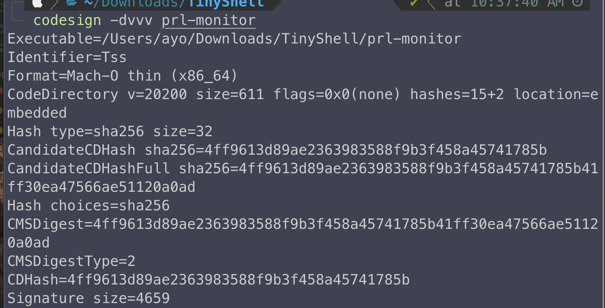
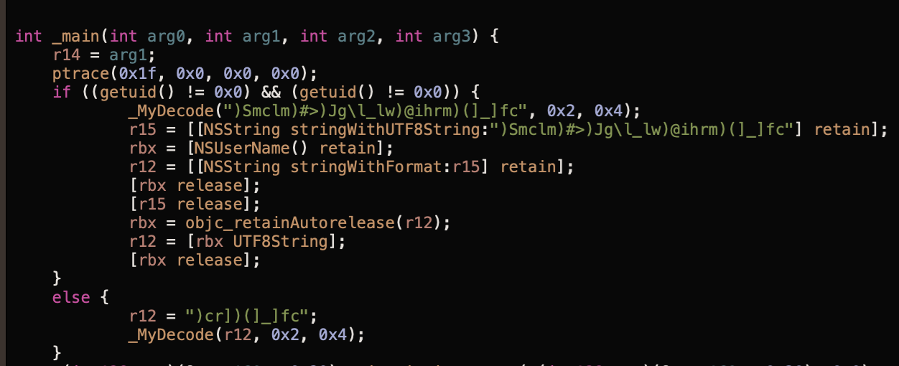
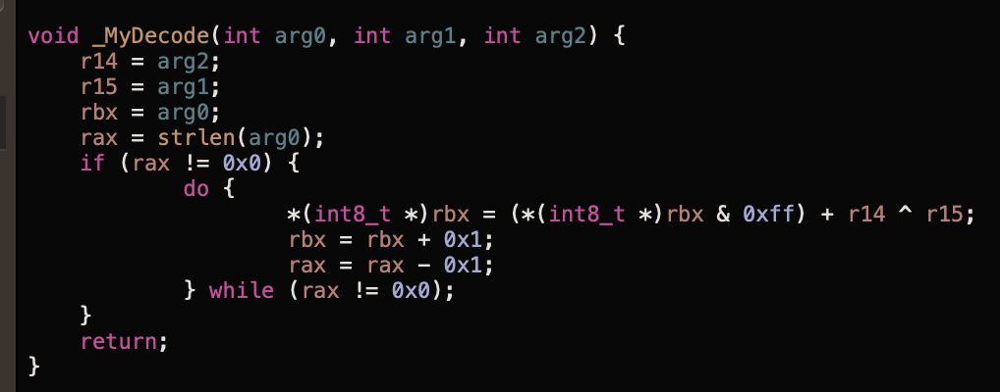
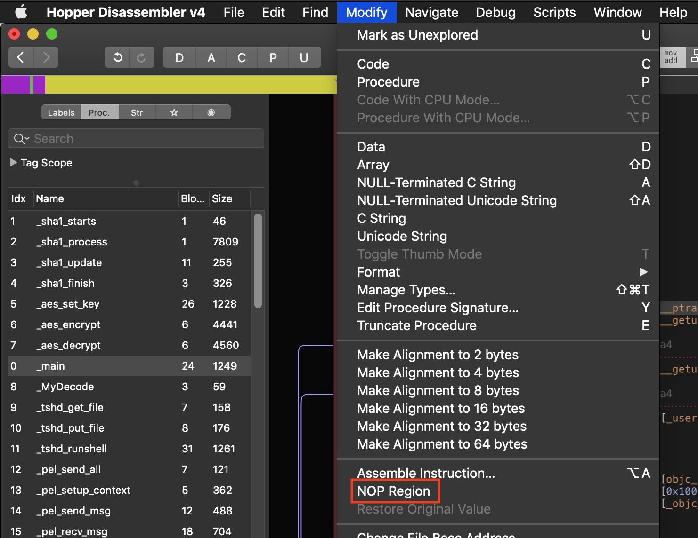
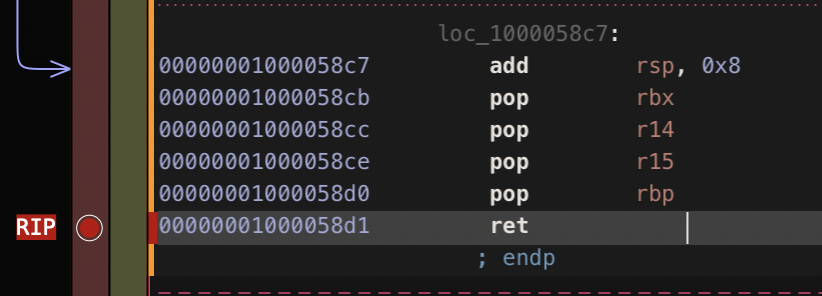
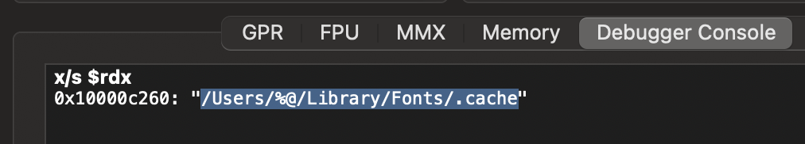
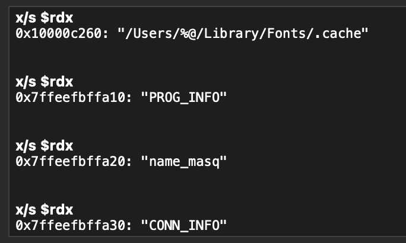

In my little journey of learning about macOS/Apple security, I will be documenting things I have learned via blogpost. This might not be useful to most researches since they probably know more about this topic but this should be a good resource for other beginners in this field.

For the first post, I will document my step in reversing a simple yet interesting malware, TinyShell. It’s important to not, I used [Mitten Mac’s post](https://themittenmac.com/tinyshell-under-the-microscope/) as a reference. I focus more on using advanced static and dynamic analysis.

# Background

Before looking at the disassembled code, I ran codesign to get some basic information about signing certificate. This would provide us with the developer identifier, format type(app bundle or command line), Authority and so on.



Now for the good part. I used hopper to get a better idea of what the malware does, If you are following, I switched to `pseudo code` mode. This is what the main function looks like.



The first thing that caught my eyes was the `_MyDecode` call but before jumping ahead, we can see that there’s a ptrace call which suggest anti debugging capabilities. I tried looking for what `0x1f` means but couldn’t find where it is defined in the linux/BSD kernel. According to Mitten Mac, the hex means `ptrace_deny_attach`. Pretty straight forward name.

Next is an if statement checking if the user that ran the program has the UID of 0 which is root. The check is done twice, reason: not really sure. Inside of the if statement is a call to a new function, `_MyDecode`. The arguments are a random series of characters and symbol, 0x2 and 0x4. Based on the name, it is safe to assume this is a decoding function for strings. Here’s the content of



The important aspect of this function is the xoring of r14 and r15. We can see that those values are the second and third argument passed to the function. Taking a step back to the main function, those values are 0x2 and 0x4. To decode the encoded strings, I have decided to use a debugger and write a simple python script to replicate the function.

# Python Script

```python
def MyDecode(encoded, key1, key2):
decode = ""
for char in encoded:
temp = (ord(char) + key1) ^ key2
decode += chr(temp)
print("Decoded string: " + decode)

encoded_string = input("Enter encoded string: ")
MyDecode(encoded_string, 0x4, 0x2)
```

Not the best code but it works 😉

[image lost]

# Debugging

To execute the malware, we have to strip off the revoked signature, quarantine flag and nop the PTRACE call. If not, macOS will pop a warning saying “It is a known malware and will delete it”. Run the commands below

- `codesign – – remove-signature`
- `xattr -d com.apple.quarantine`
- `chmod +x <binary_name>` to make it executable

Here’s how to nop the ptrace call.

[image lost]


After that, we set a breakpoint at the end of the `_MyDecode` function. At that point, the encoded string would have been decoded and be stored at the `r15` or `rdx` register.



In the debugger console, we can print the register by using `x/s $rdx`. Since I’m not running the malware as root, the instructions in the if block will be the path. That’s why we see `/Users/%@/Library/Fonts/.cache`



I ran it couple of time until I hit the breakpoint and I found more interesting strings.



Based on those strings, it is easy to say that they are configuration strings for the victim to properly communicate with the attacker’s server. It is important to note that all of these are being read from `/Users/%@/Library/Fonts/.cache`. This would be different if we are running as root.

I will stop here for now. Next time, I will figure out the config format for the malware and attempt to do dynamic analysis.

